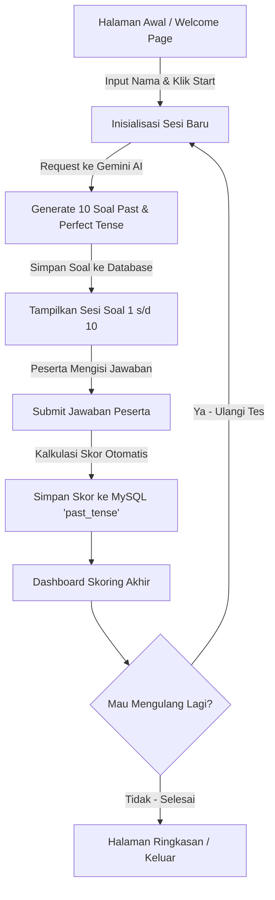

# 📋 Project Planning: AI-Powered Past Tense & Simple Perfect Tense Quiz Application

Dokumen ini berisi perencanaan arsitektur, basis data, alur kerja (workflow), serta tahapan implementasi untuk pembuatan aplikasi **Problem & Answers (Q&A Quiz)** interaktif dengan memanfaatkan **Google Gemini AI**.

---

## 📌 1. Ringkasan & Ketentuan Proyek

| Item | Deskripsi |
| :--- | :--- |
| **Nama Aplikasi** | Past & Perfect Tense Quiz AI |
| **Topik Soal** | 1. *Simple Past Tense* (V2, Did, Was/Were, Regular & Irregular verbs)<br>2. *Simple / Present Perfect Tense* (Have/Has + V3, Since/For, Already/Yet) |
| **AI Integration** | Google Gemini API (Generasi 10 soal otomatis, opsi jawaban, kunci, & penjelasan) |
| **Basis Data** | MySQL dengan database bernama `past_tense` |
| **Format Sesi** | 10 soal per sesi kuis pilihan ganda (Multiple Choice) |
| **Output Akhir** | Dashboard Skoring Komprehensif (Skor, Analisis Benar/Salah, Pembahasan Soal) |
| **Post-Quiz Action**| Konfirmasi/opsi interaktif kepada peserta untuk **Mengulang Tes (*Retake Quiz*)** atau Selesai |

---

## 🛠️ 2. Tech Stack & Environment

- **Backend**: Laravel 10 (PHP ^8.1)
- **Database**: MySQL 8.x (Nama Database: `past_tense`)
- **AI Service**: Google Gemini API (Model: `gemini-1.5-flash` / `gemini-2.0-flash` via HTTP Client Laravel)
- **Frontend / UI**: Laravel Blade Templates + Tailwind CSS (atau Bootstrap) + Alpine.js / Vanilla JS untuk interaksi kuis
- **HTTP Client**: `GuzzleHttp` / Laravel `Http::withHeaders()`

---

## 🗄️ 3. Skema Basis Data (Database Schema: `past_tense`)

```
Database: past_tense
│
├── users / participants
│   ├── id (PK)
│   ├── name
│   ├── email (opsional / nullable)
│   └── timestamps
│
├── quiz_sessions
│   ├── id (PK, UUID / BigInt)
│   ├── participant_name
│   ├── total_questions (Default: 10)
│   ├── correct_answers (Default: 0)
│   ├── final_score (0 - 100)
│   ├── status (in_progress / completed)
│   └── timestamps
│
├── questions
│   ├── id (PK)
│   ├── quiz_session_id (FK -> quiz_sessions.id)
│   ├── topic (simple_past / simple_perfect)
│   ├── question_text (Text)
│   ├── option_a (Varchar)
│   ├── option_b (Varchar)
│   ├── option_c (Varchar)
│   ├── option_d (Varchar)
│   ├── correct_answer (enum: A, B, C, D)
│   ├── explanation (Text)
│   └── timestamps
│
└── user_answers
    ├── id (PK)
    ├── quiz_session_id (FK -> quiz_sessions.id)
    ├── question_id (FK -> questions.id)
    ├── selected_answer (enum: A, B, C, D)
    ├── is_correct (Boolean)
    └── timestamps
```

---

## 🤖 4. Desain Integrasi Google Gemini AI

### Prompt Template untuk Pembuatan Soal:
Gemini AI akan diinstruksikan untuk mengembalikan format **JSON murni** tanpa format markdown tambahan agar mudah diparsing oleh Laravel:

```json
[
  {
    "topic": "Simple Past Tense",
    "question": "Yesterday, she _____ to the market to buy some fresh fruits.",
    "options": {
      "A": "go",
      "B": "went",
      "C": "gone",
      "D": "goes"
    },
    "correct_answer": "B",
    "explanation": "'Yesterday' menandakan waktu lampau (Past Tense), sehingga kata kerja yang digunakan adalah Verb 2 yaitu 'went'."
  },
  {
    "topic": "Simple Perfect Tense",
    "question": "They _____ in this company for more than five years.",
    "options": {
      "A": "have worked",
      "B": "has worked",
      "C": "worked",
      "D": "are working"
    },
    "correct_answer": "A",
    "explanation": "Subjek 'They' menggunakan auxiliary 'have' + V3 ('worked') untuk menunjukkan aksi yang dimulai di masa lampau dan masih berlanjut (Present Perfect Tense)."
  }
]
```

### Parameter Prompt AI:
1. Menghasilkan tepat **10 soal**.
2. Komposisi seimbang: **5 soal Simple Past Tense** dan **5 soal Simple Perfect Tense**.
3. Level kesulitan bertingkat (Beginner hingga Intermediate).
4. Opsi A, B, C, D yang masuk akal dan mengecoh (*distractors*).
5. Pembahasan singkat dan edukatif dalam Bahasa Indonesia.

---

## 🔄 5. Alur Kerja Aplikasi (Application Workflow)



### Detail Langkah:
1. **Welcome Screen**:
   - Peserta memasukkan nama/identitas.
   - Peserta menekan tombol **"Mulai Tes (10 Soal)"**.

2. **Proses AI Generation**:
   - Backend memanggil Gemini API dengan parameter prompt topik *Simple Past* & *Simple Perfect*.
   - Menyimpan 10 soal ke tabel `questions` yang berelasi dengan `quiz_sessions`.

3. **Pelaksanaan Tes**:
   - Kuis disajikan secara interaktif (bisa per soal dengan navigasi Next/Prev atau 1 halaman 10 soal).
   - Indikator nomor soal 1–10 dan progress bar.

4. **Kalkulasi & Penyimpanan**:
   - Saat submit, sistem mencocokkan `selected_answer` dengan `correct_answer`.
   - Skor dihitung dengan rumus:  
     $$\text{Skor} = \left(\frac{\text{Jumlah Benar}}{10}\right) \times 100$$
   - Data tersimpan rapi pada database `past_tense`.

5. **Dashboard Skoring (Scoreboard & Feedback)**:
   - **Tampilan Nilai Akhir**: Skor Angka (0-100), Persentase, Status (Lulus/Perlu Latihan).
   - **Rincian Jawaban**: Tabel perbandingan jawaban peserta vs kunci jawaban beserta penjelasan AI.
   - **Tombol Aksi**:
     - 🔄 **"Ulangi Tes Baru"**: Membuat sesi baru dengan 10 soal baru dari Gemini AI.
     - 🏠 **"Kembali ke Halaman Utama"**.

---

## 🚀 6. Rencana Tahapan Eksekusi (Implementation Roadmap)

### Tahap 1: Setup Environment & Database
- [ ] Buat database MySQL `past_tense`.
- [ ] Konfigurasi `.env`:
  ```env
  DB_CONNECTION=mysql
  DB_HOST=127.0.0.1
  DB_PORT=3306
  DB_DATABASE=past_tense
  DB_USERNAME=root
  DB_PASSWORD=

  GEMINI_API_KEY=your_google_gemini_api_key_here
  GEMINI_MODEL=gemini-1.5-flash
  ```

### Tahap 2: Database Migration & Models
- [ ] Buat Migration & Model untuk:
  - `QuizSession`
  - `Question`
  - `UserAnswer`

### Tahap 3: Service Layer Gemini AI
- [ ] Buat Service Class `App\Services\GeminiQuizService.php`.
- [ ] Implementasi method `generateQuizQuestions(int $count = 10)` dengan prompt terstruktur dan error handling/fallback jika terjadi timeout.

### Tahap 4: Controller & Routing
- [ ] Buat `QuizController.php`:
  - `index()`: Tampilan form awal.
  - `startQuiz(Request $request)`: Panggil Gemini AI, buat session, redirect ke soal.
  - `showQuiz($sessionId)`: Render form 10 soal.
  - `submitQuiz(Request $request, $sessionId)`: Kalkulasi nilai dan simpan jawaban.
  - `dashboard($sessionId)`: Tampilkan dashboard skoring lengkap & tombol ulangi tes.

### Tahap 5: Tampilan Antarmuka (Blade Views)
- [ ] `resources/views/quiz/welcome.blade.php`: Halaman input nama & instruksi kuis.
- [ ] `resources/views/quiz/quiz.blade.php`: Halaman 10 soal pilihan ganda interaktif.
- [ ] `resources/views/quiz/dashboard.blade.php`: Dashboard skor, rincian benar/salah, penjelasan AI, dan tombol retake.

### Tahap 6: Pengujian & Validasi
- [ ] Verifikasi kestabilan respon JSON dari Gemini API.
- [ ] Verifikasi keakuratan skoring pada database MySQL `past_tense`.
- [ ] Pengujian alur pengulangan tes (*retake flow*).
